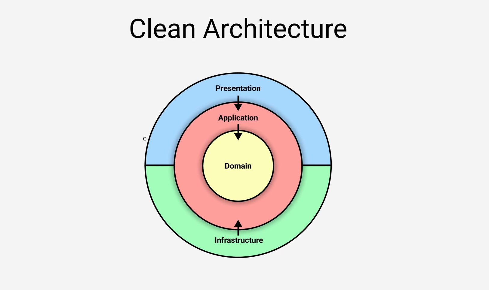
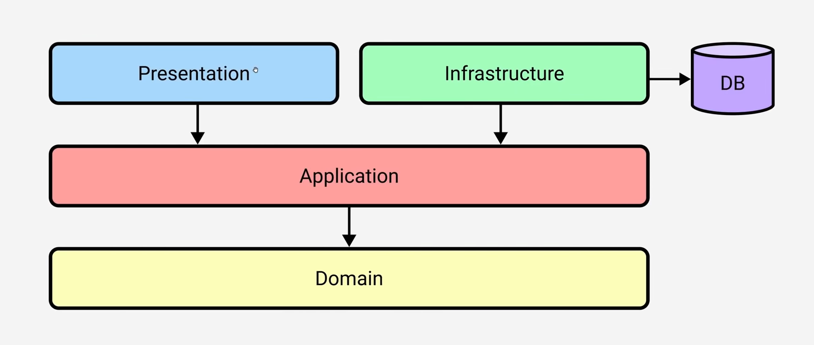

<div align="center">



 [](https://github.com/dvlop3r/Bookstore/stargazers) [](https://github.com/dvloper/Bookstore/LICENSE)

---

### This is the source code of the [Bookstore API and client using .NET 6](https://github.com/dvlop3r/Bookstore)

</div>

- [Give it a star ⭐!](#give-it-a-star-)
- [Overview](#overview)
- [Service Architecture](#service-architecture)
- [Technologies](#fancy-tech-used)
- [Usage](#usage)
- [API Definition](#api-definition)
  - [Create Book](#create-Book)
    - [Create Book Request](#create-book-request)
    - [Create Book Response](#create-book-response)
  - [Get Book](#get-Book)
    - [Get Book Request](#get-book-request)
    - [Get Book Response](#get-book-response)
  - [Update Book](#update-book)
    - [Update Book Request](#update-book-request)
    - [Update Book Response](#update-book-response)
  - [Delete Book](#delete-book)
    - [Delete Book Request](#delete-book-request)
    - [Delete Book Response](#delete-book-response)
- [Credits](#credits)
- [VSCode Extensions](#vscode-extensions)
- [Disclaimer](#disclaimer)
- [License](#license)

---

# Give it a star ⭐!

Loving it? Show your support by giving this project a star!

# Overview

This is a book store CRUD-based app that helps storing book pdf files along with their description. It uses Clean Architecture and Domain-Driven Design in .Net 6 to build a RESTful Api and a beautiful MVC client.

- Backend
    - Bookstore.Api
    - Bookstore.Contracts
    - Bookstore.Application
    - Bookstore.Domain
    - Bookstore.Infrastructure
- Frontend
    - Bookstore.Client

# Service Architecture

<div align="center">




</div>

# Fancy tech used

<div>
<ul>
    <li><b>Clean Architecture and DDD</b></li>
    <li><b>CQRS+Mediator</b></li>
    <li><b>Pipeline behaviour</b></li>
    <li><b>Fluent Validation</b></li>
    <li><b>UnitOfWork</b></li>
    <li><b>Repository</b></li>
    <li><b>Singleton</b></li>
    <li><b>global exception handler/filter</b></li>
    <li><b>problem+json api response</b></li>
    <li><b>JWT</b></li>
    <li><b>Api versioning</b></li>
    <li><b>docker with docker compose</b></li>
    <li><b>Elasticsearch with multi search</b></li>
</ul>
</div>

# Usage

Simply `git clone https://github.com/dvlop3r/Bookstore` and `docker compose up`.

# API Definition

## Create Book

### Create Book Request

```js
POST /api/bookstore
```

```json
{
    "title" : "title1",
    "author" : "Sarwan",
    "description" : "title1 description",
    "publishDate" : "2022-09-17",
    "coverImageUrl" : "cover image url",
    "bookUrl" : "book url"
}
```

### Create Book Response

```js
201 Created
```

```yml
Location: {{host}}/api/bookstore/{{id}}
```

```json
{
    "id": "00000000-0000-0000-0000-000000000000",
    "title" : "title1",
    "author" : "Sarwan",
    "description" : "title1 description",
    "publishDate" : "2022-09-17",
    "coverImageUrl" : "cover image url",
    "bookUrl" : "book url",
    "updated" : "2022-09-17",
    "created" : "2022-09-17"
}
```

## Get Books

### Get Books Request

```js
GET /api/bookstore
```

### Get Books Response

```js
200 Ok
```

```json
[
    {
    "id": "00000000-0000-0000-0000-000000000000",
    "title" : "title1",
    "author" : "Sarwan",
    "description" : "title1 description",
    "publishDate" : "2022-09-17",
    "coverImageUrl" : "cover image url",
    "bookUrl" : "book url",
    "updated" : "2022-09-17",
    "created" : "2022-09-17"
    }
]
```


## Get Book

### Get Book Request

```js
GET /api/bookstore/{{id}}
```

### Get Book Response

```js
200 Ok
```

```json
{
    "id": "00000000-0000-0000-0000-000000000000",
    "title" : "title1",
    "author" : "Sarwan",
    "description" : "title1 description",
    "publishDate" : "2022-09-17",
    "coverImageUrl" : "cover image url",
    "bookUrl" : "book url",
    "updated" : "2022-09-17",
    "created" : "2022-09-17"
}
```

## Update Book

### Update Book Request

```js
PUT /api/bookstore/{{id}}
```

```json
{
    "title" : "title1",
    "author" : "Sarwan",
    "description" : "title1 description",
    "publishDate" : "2022-09-17",
    "coverImageUrl" : "cover image url",
    "bookUrl" : "book url",
    "updated" : "2022-09-17",
    "created" : "2022-09-17"
}
```

### Update Book Response

```js
204 No Content
```

or

```js
201 Created
```

```yml
Location: {{host}}/api/bookstore/{{id}}
```

## Delete Book

### Delete Book Request

```js
DELETE /api/bookstore/{{id}}
```

### Delete Book Response

```js
204 No Content
```


# Credits


# VSCode Extensions

- [VSCode Rest Client](https://github.com/Huachao/vscode-restclient) - REST Client allows you to send HTTP request and view the response in Visual Studio Code directly.

- [VSCode Markdown Preview Enhanced](https://github.com/shd101wyy/vscode-markdown-preview-enhanced) - Markdown Preview Enhanced is an extension that provides you with many useful functionalities for previewing markdown files.

# Disclaimer

This is a project just for fun. The source code is licensed under the MIT license.

# License

This project is licensed under the terms of the [MIT](https://github.com/dvlop3r/Bookstore/blob/main/LICENSE) license.